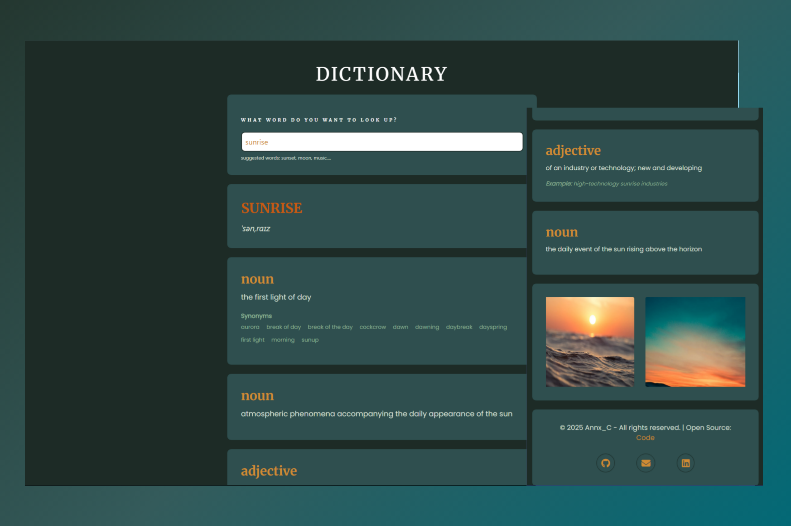

# 📚 Diccionario Web con React

Aplicación web que permite buscar definiciones de palabras y obtener imágenes relacionadas, utilizando una **API de Diccionario** y una **API de Imágenes**. Web resposive para diferentes dispositivos.

## 🚀 Demo

🔗 **Prueba la aplicación aquí:** [ENLACE_DEMO](https://dictionary-react-project-annx.netlify.app/)

## 🖼 Vista previa

## 🛠 Tecnologías utilizadas

- **React**
- **HTML**
- **CSS**  
- **Free Dictionary API** 
- **Pexels API**

